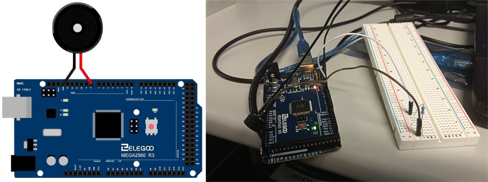
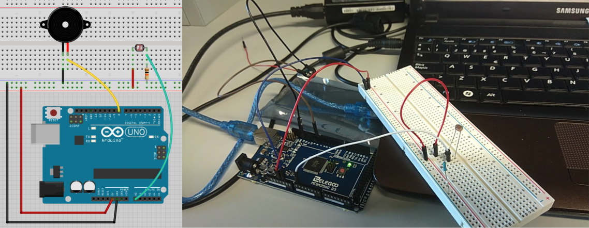
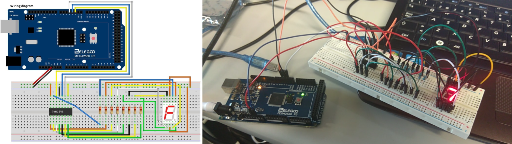

## Práctica 5: Arduino
##### Por:Arturo Cortés Sánchez

### Zumbador pasivo



```c
#include "pitches.h"
 
 // notes in the melody:
int melody[] = {NOTE_C5, NOTE_D5, NOTE_E5, NOTE_F5, NOTE_G5, NOTE_A5, NOTE_B5, NOTE_C6};
int duration = 500;  // 500 miliseconds
void setup() {}
void loop() {  
  for (int thisNote = 0; thisNote < 8; thisNote++) {
    tone(8, melody[thisNote], duration);  // pin8 output the voice, every scale is 0.5 sencond
    delay(1000);  // Output the voice after several minutes
  }
  delay(2000);  // restart after two seconds 
}
```
---

### Theremín de luz

 

```c

int sensorValue;		// variable to hold sensor value
int sensorLow = 1023;	// variable to calibrate low value
int sensorHigh = 0;		// variable to calibrate high value
const int ledPin = 13;	// LED pin

void setup() {
  pinMode(ledPin, OUTPUT);	// Make the LED pin an output and turn it on
  digitalWrite(ledPin, HIGH);
  while (millis() < 5000) {	// calibrate for the first five seconds after program runs
    sensorValue = analogRead(A0);	// record the maximum sensor value
    if (sensorValue > sensorHigh) {
      sensorHigh = sensorValue;
    }
    if (sensorValue < sensorLow) {	 // record the minimum sensor value
      sensorLow = sensorValue;
    }
  }
  digitalWrite(ledPin, LOW);// turn the LED off, signaling the end of the calibration period
}

void loop() {
  sensorValue = analogRead(A0);	//read the input from A0 and store it in a variable
  int pitch = map(sensorValue, sensorLow, sensorHigh, 50, 4000); // map the sensor values to a wide range of pitches
  tone(8, pitch, 20);	// play the tone for 20 ms on pin 8
  delay(10);	// wait for a moment
}
```
---
### Display de 7 segmentos

 

```c
byte seven_seg_digits[10] = { B11111100,  // = 0
                              B01100000,  // = 1
                              B11011010,  // = 2
                              B11110010,  // = 3
                              B01100110,  // = 4
                              B10110110,  // = 5
                              B10111110,  // = 6
                              B11100000,  // = 7
                              B11111110,  // = 8
                              B11100110   // = 9
                             };
int latchPin = 3;	// connect to the ST_CP of 74HC595 (pin 3,latch pin)
int clockPin = 4;	// connect to the SH_CP of 74HC595 (pin 4, clock pin)
int dataPin = 2;	// connect to the DS of 74HC595 (pin 2)
 
void setup() {
  pinMode(latchPin, OUTPUT);	// Set latchPin, clockPin, dataPin as output
  pinMode(clockPin, OUTPUT);
  pinMode(dataPin, OUTPUT);
}
 
void sevenSegWrite(byte digit) { // display a number on the digital segment display
  digitalWrite(latchPin, LOW); // set the latchPin to low potential, before sending data
  shiftOut(dataPin, clockPin, LSBFIRST, seven_seg_digits[digit]);  // the original data (bit pattern)
  digitalWrite(latchPin, HIGH);	// set the latchPin to high potential, after sending data
}
 
void loop() {       
  for (byte digit = 10; digit > 0; --digit) {	// count from 9 to 0
    delay(1000);
    sevenSegWrite(digit - 1); 
  }
  delay(1000);	// suspend 4 seconds
}
```
