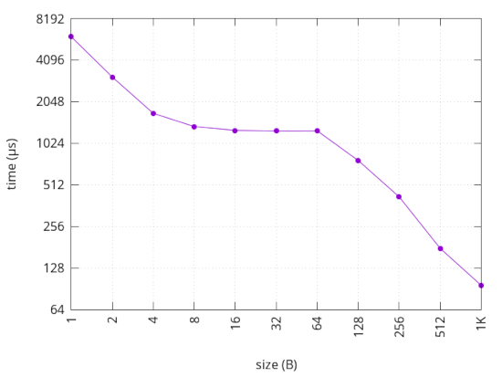
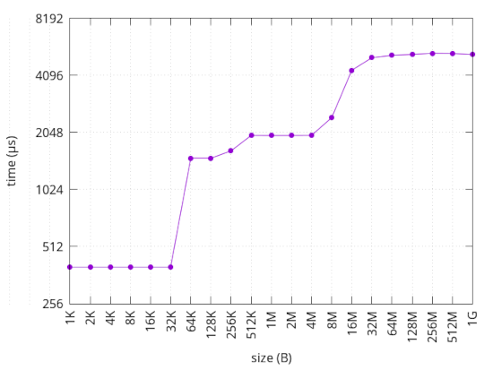
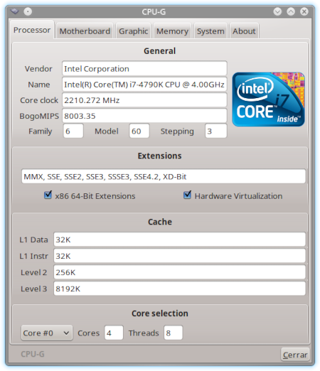

## Práctica 6: Caché
##### Por: Arturo Cortés Sánchez

#### Grafica generada por line.cc:

 

En esta gráfica podemos ver como a partir de los 64B hay un pico a partir del cual el tiempo pasa a descender de forma casi lineal, así que podemos asumir que el procesador en el que `line.cc` fue ejecutado tiene un tamaño de linea de 64B

#### Grafica generada por size.cc:

 

En esta gráfica vemos como el tiempo se mantiene constante hasta los 32K y justo despues hay un salto de tiempo importante, el mayor de toda la gráfica. Despues se mantiene mas o menos constante hasta los 256K donde hay un salto mas suave que el anterior. Desde 256K hasta 8M vemos que la grafica se mantiene constante a excepción de los extremos del semento en cuestión. A partir de los 8M se vuelve a apreciar un salto significativo.  Finalmente la gráfica se estabiliza ya que las necesidades de memoria del proceso superan el caché del procesador, por lo que pasa a usarse la memoria principal.

Podemos concluir que el procesador en el que se ejecutó `size.cc` cuenta con 32K de caché L1, 256K de caché L2 y 8M de caché L3.

#### Captura de CPU-G:

 

#### Salida de lscpu:
```markdown
[arturo@arturo-pc 2 Ficheros]$ lscpu
Arquitectura:                        x86_64
modo(s) de operación de las CPUs:    32-bit, 64-bit
Orden de los bytes:                  Little Endian
Tamaños de las direcciones:          39 bits physical, 48 bits virtual
CPU(s):                              8
Lista de la(s) CPU(s) en línea:      0-7
Hilo(s) de procesamiento por núcleo: 2
Núcleo(s) por «socket»:              4
«Socket(s)»                          1
Modo(s) NUMA:                        1
ID de fabricante:                    GenuineIntel
Familia de CPU:                      6
Modelo:                              60
Nombre del modelo:                   Intel(R) Core(TM) i7-4790K CPU @ 4.00GHz
Revisión:                            3
CPU MHz:                             2971.767
CPU MHz máx.:                        4400,0000
CPU MHz mín.:                        800,0000
BogoMIPS:                            8003.35
Virtualización:                      VT-x
Caché L1d:                           32K
Caché L1i:                           32K
Caché L2:                            256K
Caché L3:                            8192K
CPU(s) del nodo NUMA 0:              0-7
Indicadores:                         fpu vme de pse tsc msr pae mce cx8 apic sep mtrr pge mca cmov pat pse36 clflush dts acpi mmx fxsr sse sse2 ss ht tm pbe syscall nx pdpe1gb rdtscp lm constant_tsc arch_perfmon pebs bts rep_good nopl xtopology nonstop_tsc cpuid aperfmperf pni pclmulqdq dtes64 monitor ds_cpl vmx est tm2 ssse3 sdbg fma cx16 xtpr pdcm pcid sse4_1 sse4_2 x2apic movbe popcnt tsc_deadline_timer aes xsave avx f16c rdrand lahf_lm abm cpuid_fault invpcid_single pti ssbd ibrs ibpb stibp tpr_shadow vnmi flexpriority ept vpid fsgsbase tsc_adjust bmi1 avx2 smep bmi2 erms invpcid xsaveopt dtherm ida arat pln pts flush_l1d
```

#### Salida de make info
```markdown
[arturo@arturo-pc 2 Ficheros]$ make info
line size = 64B
cache size = 32K/32K/256K/8192K/
cache level = 1/1/2/3/
cache type = Data/Instruction/Unified/Unified/
```