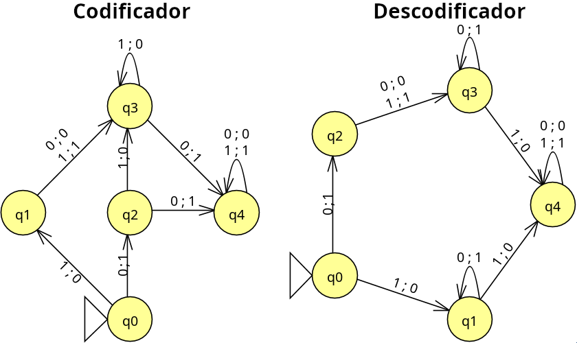

# Prácticas MC

##### Por: Arturo Cortés Sánchez
---
## Práctica 1:

Determinar si la gramática G= ({S,A,B},{a,b,c,d},P,S) dónde P es el conjunto de reglas de producción:

$$
S → AB 	\ A→Ab 	\ A→a 	\ B→cB 	\ B→d
$$
genera un lenguaje de tipo 3

Para saber si es de tipo 3 primero necesitamos conocer el lenguaje que genera. Empezamos por ver las posibles lineas de derivación:
Partiendo de S solo podemos generar AB, partiendo de A podemos generar todas las 'b' que queramos a la derecha y acabar con una a 'a' la izquierda .Partiendo de B podemos generar todas las 'c' que queramos a la izquierda y acabar con una 'd' a la derecha. 

Habiendo explorado las lineas de derivación podemos concluir que la gramática genera cadenas del tipo 'abbbbccd' donde las cadenas de 'b' y 'c' pueden ser de cualquier tamaño, por tanto el lenguaje es:

$$
\{a b^i c^j d : i , j \in \Bbb N\}
$$
Para afirmar que el lenguaje es de tipo 3 necesito encontrar una gramática regular que lo genere, puesto que la inicial no lo es.

Empezamos generando el símbolo terminal 'a' y una variable para poder seguir avanzando: `S → aB`, luego utilizamos esa variable para generar todas las 'b' que queramos ` B → bB`. Una vez hayamos acabado de generar las 'b' cambiamos la variable para que no puedan volver a generarse `B → C` y generamos las 'c' `C → cC`. Para acabar hace falta poner el símbolo terminal 'd' `C → d`

Por tanto la gramática de tipo 3 que genera el lenguaje sería:

$$
S → aB 	\ B → bB 	\ B → C 	\ C → cC 	\ C → d
$$
Y como dicha gramática existe, el lenguaje en cuestión es de tipo 3.

## Práctica 2: Codificador/decodificador César

En esta práctica he optado por codificar la entrada usando el código cesar. El cifrado cesar es un cifrado clásico que consiste en reemplazar cada letra por por la que se encuentra tres posiciones adelante en el abecedario. Así la letra A quedaría convertida en una D.
  El autómata del codificador recibe los 5 bits menos significativos de la representación ASCII de un carácter y devuelve los 5 bits menos significativos del carácter tres posiciones posterior. El descodificador por su parte recibe una entrada de las mismas características pero devuelve  los 5 bits menos significativos del carácter tres posiciones antes. Ambos autómatas empiezan leyendo el la representación del carácter por la derecha.

En concreto el codificador y el decodificador han sido probados con este conjunto:
```c
A : 00001	 B : 00010	 C : 00011	 D : 00100	 E : 00101	 F : 00110
G : 00111	 H : 01000	 I : 01001	 J : 01010	 K : 01011	 L : 01100
M : 01101	 N : 01110	 O : 01111	 P : 10000	 Q : 10001	 R : 10010
S : 10011	 T : 10100	 U : 10101	 V : 10110	 W : 10111	 X : 11000
Y : 11001	 Z : 11010
```
He optado por utilizar este subconjunto de ASCII ya que se mantiene constante entre las mayúsculas y las minúsculas. Para convertir cualquier letra de este subconjunto a ASCII mayúscula basta con ponerle delante `010` a la representación de la letra escogida, mientras que para que sea minúscula basta con ponerle `011` delante.

---

### Autómatas:

 

---

## Práctica 2: Lex Conversor Brainfuck/Ook! en Lex

### Introducción
Brainfuck es un lenguaje de programación esotérico inspirado en la máquina de Turing. Se basa en en un vector de al menos 30000 bytes inicializados a cero, un puntero que inicialmente apunta al primer byte, y dos flujos, uno de entrada y otro de salida. Consta únicamente de ocho instrucciones, cada una compuesta de un único carácter.

Ook! es otro lenguaje esotérico, es una parodia de Brainfuck, y según su diseñador, está diseñado para orangutanes. Consta de tres palabras (Ook., Ook?, y Ook!) las cuales se agrupan en parejas para formar ocho cadenas, cada una equivalente a una instrucción de Brainfuck.

| Carácter Brainfuck | 	Equivalencia en Ook! |                    Significado                                                         |
|:------------------:|----------------------:|----------------------------------------------------------------------------------------|
|          >		 |		 Ook. Ook?       | Incrementa el puntero.                                                                 |
|          <		 |       Ook? Ook.       | Decrementa el puntero.                                                                 |
|          +		 |	     Ook. Ook.       | Incrementa el byte apuntado.             				                              |
|          -		 |		 Ook! Ook! 		 | Decrementa el byte apuntado.				                                              |
|          .		 |		 Ook! Ook.  	 | Escribe el byte apuntado en el flujo de salida.                                        |
|          ,		 |		 Ook. Ook!  	 | Lee un byte del flujo de entrada y lo almacena en el byte apuntado.                    |
|          [		 |		 Ook! Ook?  	 | Avanza a la instrucción inmediatamente posterior al "]" correspondiente si el byte actualmente apuntado es 0.                |
|          ]		 |		 Ook? Ook!  	 | Retrocede a la instrucción inmediatamente posterior al "[" correspondiente si el byte actualmente apuntado es distinto de 0. |

Cualquier otro carácter o cadena que no esté en la tabla es ignorado.

### Conversor Brainfuck/Ook!
Este programa es capaz de convertir código Brainfuck a Ook! y viceversa, así como convertir cualquiera de los dos a C o C++ correctamente tabulado. Basta con llamar al programa y pasar como argumentos el código a convertir (el programa detectará si es Ook! o Brainfuck) y el archivo de salida. Opcionalmente se puede añadir un tercer argumento para indicar el lenguaje al que se quiere convertir el código de entrada, si no se pasa este tercer argumento el código será convertido a C por defecto.

```c
Modo de uso: ./conversor <fichero de entrada en Ook! o Brainfuck> <fichero de salida> [Opciones] 
Opciones:
        -c : Convertir código Brainfuck o Ook! a código C 
        -cpp : Convertir código Brainfuck o Ook! a código C++ 
        -b : Convertir código Ook! a Brainfuck
        -o : Convertir código Brainfuck a Ook!
        -e : [Opcional] Compilar y ejecutar el codigo C o C++ generado (requiere gcc o g++)

        Si no se recibe ninguna opción, se usará -c por defecto

        Ejemplo: Convertir a C++, compilar y ejecutar el archivo hello.b:
        ./conversor hello.b hello.cpp -cpp -e

```

La conversión a C es una variación de la estándar, que en lugar de un puntero, usa una variable "índice" para permitir agrupar varias intrucciones Brainfuck/Ook! en una sola línea. La conversión a C++ dista algo del estándar ya que usa un vector de la STL en lugar de un array de C, esto le confiere más flexibilidad y hace que ciertos casos extremos funcionen, así como que otros que se ciñen estrictamente al estándar fallen.

### Compilación
```shell
$ flex conversor.l && gcc lex.yy.c -o conversor -lfl
```

### Ejemplo de uso
```shell
 $./conversor hello.ook hello.c -e

***************************************************
*                                                 *
*                 Práctica 2: Lex                 *
*            Conversor Brainfuck/Ook!             *
*                                                 *
***************************************************

        Código Ook! detectado.
        Convirtiendo a C.
        Archivo "hello.c" creado con éxito.
        Compilando el archivo "hello.c".
        Se creará y ejecutará el archivo "hello.c.bin".
        gcc hello.c -o hello.c.bin -O2 && ./hello.c.bin

Hello World!
```

### Programas de ejemplo

Junto al código lex y este PDF se entregan una serie de archivos que contienen el código en Brainfuck y Ook! de algunos programas que he encontrado por internet.

En la siguiente tabla se explica el funcionamiento de cada programa.

| Programa     | Objetivo del programa                                                                                                                                                               |
|--------------|-------------------------------------------------------------------------------------------------------------------------------------------------------------------------------------|
| game-of-life.bf | Versión simple del juego de la vida. Introducir fg para activar la casilla de la fila "f" y la columna "g". Pulsar intro para calcular la siguiente generación. No funciona en C++. |
| hello.ook        | Imprime Hello World!                                                                                                                                                                |
| mandelbrot.bf      | Genera la representación matemática del conjunto de mandelbrot con caracteres ASCII.                  |

----

## Práctica 4: Autómata con pila               

Obtener la gramatica generada por el siguiente autómata con pila

$$
M=(\{q_0, q_1\},\{0,1\},\{X,Z\}, \delta, q_0, Z_0,  \emptyset) \\
1. 	\ \delta(q_0, 0, Z_0)=\{(q_0,XZ_0)\}\\
2. 	\ \delta(q_1, 1, X) \  \ =\ \  \{(q_1,\epsilon )\}\\
3. 	\ \delta(q_0, 0, X)=\{(q_0,XX)\}\\
4. 	\ \delta(q_1, \epsilon,X) \  \ =\ \  \{(q_1,\epsilon )\}\\
5. 	\ \delta(q_0, 1, X)\  \ =\ \  \{(q_1,\epsilon)\}\\
6. 	\ \delta(q_1, \epsilon, Z_0)\  \ =\ \  \{(q_1,\epsilon)\}\\
$$

$$
S→[q_0,Z_0,q_0], 		\ S→[q_0,Z_0,q_1]
$$


$$
1. \\ [q_0,Z_0,q_0]→0[q_0,X,q_0][q_0,Z_0,q_0]\\
[q_0,Z_0,q_1]→0[q_0,X,q_0][q_0,Z_0,q_1]\\
[q_0,Z_0,q_0]→0[q_0,X,q_1][q_1,Z_0,q_1]\\
[q_0,Z_0,q_1]→0[q_0,X,q_1][q_1,Z_0,q_1]\\
$$

$$
2. \\
[q_1,X,q_1]→1
$$

$$
3. \\ [q_0,X,q_0]→0[q_0,X,q_0][q_0,X,q_0]\\
[q_0,X,q_1]→0[q_0,X,q_0][q_0,X,q_1]\\
[q_0,X,q_0]→0[q_0,X,q_1][q_1,X,q_0]\\
[q_0,X,q_1]→0[q_0,X,q_1][q_1,X,q_1]\\
$$

$$
4.\\
[q_1,X,q_1]→\epsilon
$$

$$
5.\\
[q_0,X,q_1]→1
$$

$$
6.\\
[q_1,Z_0,q_1]→\epsilon
$$

Al eliminar lar producciones inútiles queda:
$$
S→[q_0,Z_0,q_1]\\
[q_0,Z_0,q_1]→0[q_0,X,q_1][q_1,Z_0,q_1]\\
[q_0,X,q_1]→0[q_0,X,q_1][q_1,X,q_1]\\
[q_1,X,q_1]→1\\
[q_1,X,q_1]→\epsilon \\
[q_0,X,q_1]→1 \\
[q_1,Z_0,q_1]→\epsilon \\
$$

La gramática genera el siguiente lenguaje:
$$
L(G)=\{ 0^i 1^j : i \ge j \ge 1\}
$$