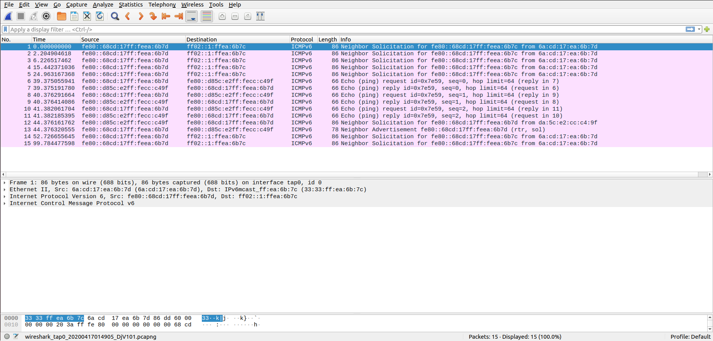
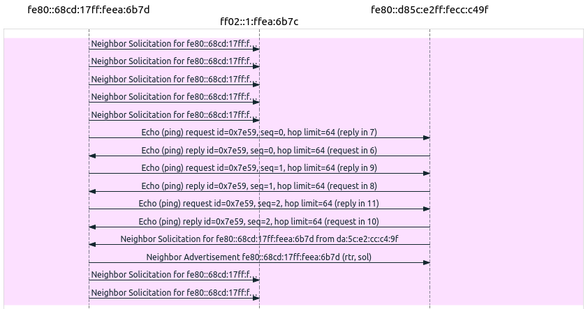
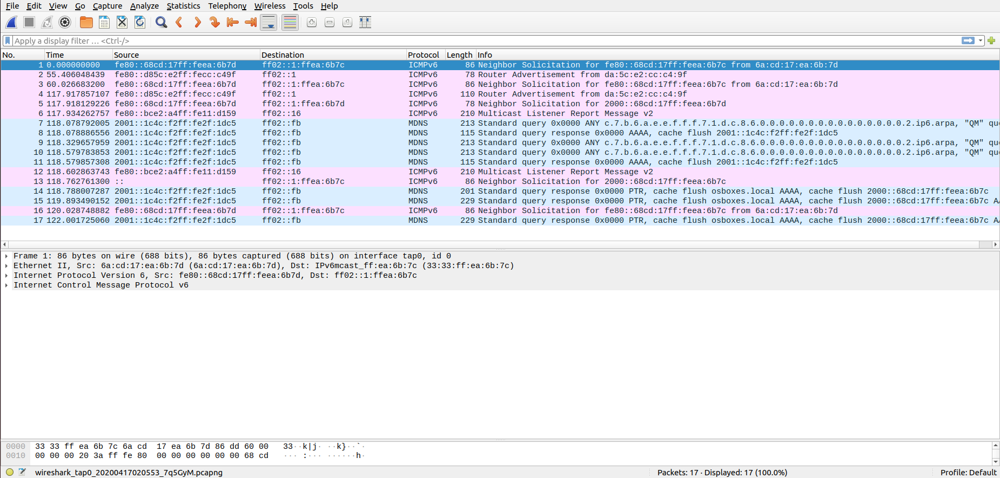
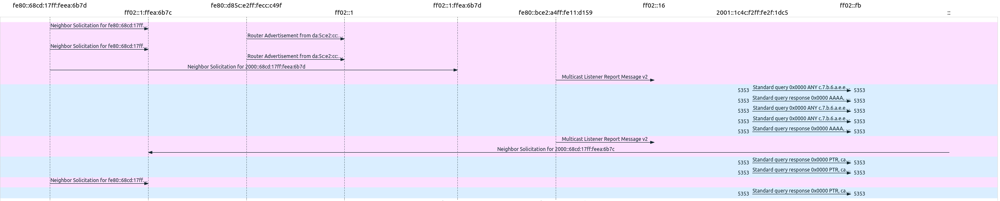
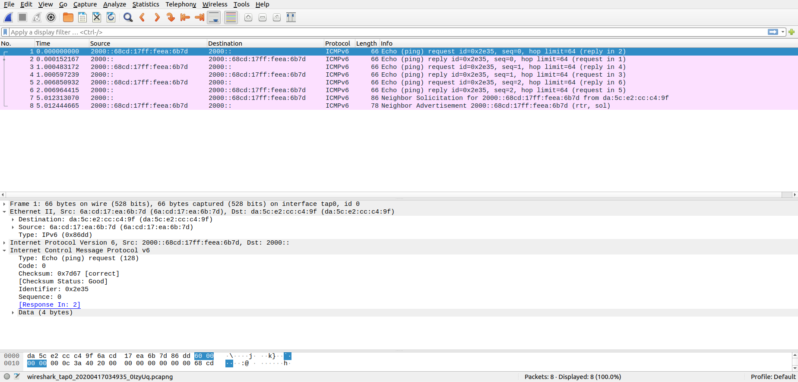
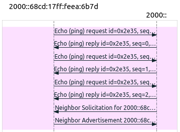
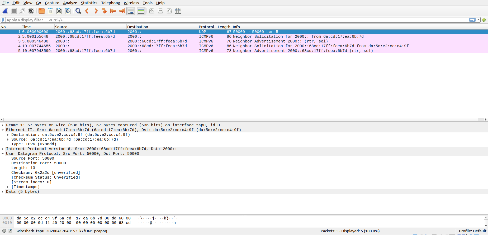
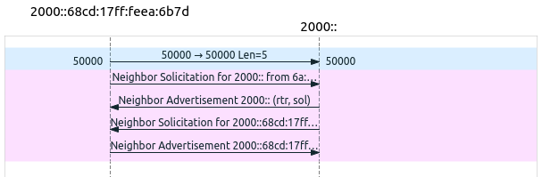

# IPv6 Lab Report

##### Arturo Cortés Sánchez

1. Find and describe all IPv6 and physical addresses assigned to each machine and its configuration.  

   a. By using the “ifconfig” command on each machine, find out the Link-layer ethernet physical address, the IPv6 link-local address of each machine and the multicast address to which each device has subscribed. Include all addresses in your report and specify which one is which. 

   ​	tap0:

   ````
   Link-layer ethernet physical address: DA:5C:E2:CC:C4:9F 
   IPv6 link-local address: fe80::d85c:e2ff:fecc:c49f
   Multicast addresses: ff02::2, ff02::1, ff02::1:ffcc:c49f, ff02::1a
   ````

   ​	tap1:

   ````
   Link-layer ethernet physical address: 6A:CD:17:EA:6B:7D
   IPv6 link-local address: fe80::68cd:17ff:feea:6b7d
   Multicast addresses: ff02::2, ff02::1, ff02::1:ffea:6b7d, ff02::1a
   ````

   ---

   b. Are there any IPv6 global address configured in any RIOT-OS machine? There should none, why? 

   There are no global addresses because none start with 001, and there shouldn't be any because no global prefix has been advertised.

   ---

   c. By using the “nib neigh” command, find out the list of neighbouring nodes on each RIOT-OS machine. There should none, why? 

   ​	tap0:

   ````
   fe80::bce2:a4ff:fe11:d159 dev #6 lladdr 6A:CD:17:EA:6B:7C  STALE
   fe80::68cd:17ff:feea:6b7d dev #6 lladdr 6A:CD:17:EA:6B:7D router STALE
   ````

   ​	tap1:

   ````
   fe80::68cd:17ff:feea:6b7c dev #6 lladdr 6A:CD:17:EA:6B:7C  UNREACHABLE
   fe80::bce2:a4ff:fe11:d159 dev #6 lladdr 6A:CD:17:EA:6B:7C  STALE
   fe80::d85c:e2ff:fecc:c49f dev #6 lladdr DA:5C:E2:CC:C4:9F router STALE
   ````

---

2. Verify connectivity using the IPv6 link-local address. 

   a. By using the “ping6” command, make a ping from one machine (say, the one running on tap0) to the other machine (say, the one running on tap1) using the IPv6 link-local address. Make sure the Wireshark capture was enabled and that you see the Echo messages from ICMPv6 captured. 

   

   

   

   

   ---

   b. Are there any other messages transmitted before or after the ICMPv6 Echo messages? Why? 

   There are neighbor advertisement and neighbor solicitation messages after the ping  packets. These packets are send to see if there has been any changes in the route between the devices.

   ---

   c. By using the “nib neigh” command, find out the list of neighbouring nodes on each RIOT-OS machine (again). Did the table change with respect to the first point? Why? 

   ​	tap0:

   ````
   fe80::bce2:a4ff:fe11:d159 dev #6 lladdr 6A:CD:17:EA:6B:7C  STALE
   fe80::68cd:17ff:feea:6b7d dev #6 lladdr 6A:CD:17:EA:6B:7D router REACHABLE
   ````

   ​	tap1:

   ````
   fe80::68cd:17ff:feea:6b7c dev #6 lladdr 6A:CD:17:EA:6B:7C  UNREACHABLE
   fe80::bce2:a4ff:fe11:d159 dev #6 lladdr 6A:CD:17:EA:6B:7C  STALE
   fe80::d85c:e2ff:fecc:c49f dev #6 lladdr DA:5C:E2:CC:C4:9F router STALE
   ````

   They have changed, now tap0 shows tap1 address as router reachable because tap0 received a neighbor advertisement message from tap1.

   ---

   

3. Configuring an IPv6 global address. 

   a. By using the “ifconfig add” command, add a global address to one, and only one, of the nodes. Are there any messages transmitted just after the assignment? Why? 

   

   

   

   

   ---

   b. By using the “ifconfig” command, check the global address for each node. Did the second node self-configure a global IPv6 address? Why? How? 

   Yes, the second device has a global address because executing the command on the first device has  also caused it to announce the global prefix. This new address is generated by replacing the first hextet of the local link address with the global prefix.

   ---

   c. By using the “nib neigh” command, find out the list of neighbouring nodes on each RIOT-OS machine (again). Did the table change with respect to the second point? Why? 

   ​	tap0:

   ````
   fe80::bce2:a4ff:fe11:d159 dev #6 lladdr 6A:CD:17:EA:6B:7C  STALE
   fe80::68cd:17ff:feea:6b7d dev #6 lladdr 6A:CD:17:EA:6B:7D router STALE	
   ````

   ​	tap1:

   ````
   fe80::68cd:17ff:feea:6b7c dev #6 lladdr 6A:CD:17:EA:6B:7C  UNREACHABLE
   fe80::bce2:a4ff:fe11:d159 dev #6 lladdr 6A:CD:17:EA:6B:7C  STALE
   fe80::d85c:e2ff:fecc:c49f dev #6 lladdr DA:5C:E2:CC:C4:9F router STALE
   ````

   tap1 address in tap0 table has changed back to router STALE. I'm not sure why.

   ---

   

4. Verify connectivity using the IPv6 global address. 

   a. By using the “ping6” command, make a ping from one machine (say, the one running on tap0) to the other machine (say, the one running on tap1) using the IPv6 global address. Make sure the Wireshark capture was enabled and that you see the Echo messages from ICMPv6 captured. 

   

   

   

   b. Are there any other messages transmitted before or after the ICMPv6 Echo messages? Why? 

   As usual there is a neighbor solicitation and a neighbor advertisement message after the last echo  reply to keep track of possible changes in the route.

   c. By using the “nib neigh” command, find out the list of neighbouring nodes on each RIOT-OS machine (again). Did the table change with respect to the third point? Why? 

   ​	tap0:

   ````
   fe80::bce2:a4ff:fe11:d159 dev #6 lladdr 6A:CD:17:EA:6B:7C  STALE
   fe80::68cd:17ff:feea:6b7d dev #6 lladdr 6A:CD:17:EA:6B:7D router STALE
   2000::68cd:17ff:feea:6b7d dev #6 lladdr 6A:CD:17:EA:6B:7D  STALE
   ````

   ​	tap1:

   ````
   fe80::68cd:17ff:feea:6b7c dev #6 lladdr 6A:CD:17:EA:6B:7C  UNREACHABLE
   fe80::bce2:a4ff:fe11:d159 dev #6 lladdr 6A:CD:17:EA:6B:7C  STALE
   fe80::d85c:e2ff:fecc:c49f dev #6 lladdr DA:5C:E2:CC:C4:9F router STALE
   ````

   

   The ping sender global address has been added to the ping receiver table because this new address could be from a new device and should therefore be added to the table.

---


5. Test UDP transmission. 

   a. By using the “udp” command, send an UDP datagram from one host to the other. The UDP server is working on port 50000 in each RIOT-OS machine. Describe the message exchanges captured in Wireshark. 

   

   

   

   The first message is an UDP datagram containing the sent string. The next four messages are neighbor advertisement and discovery that both devices exchange to keep track of changes in the path that links them.