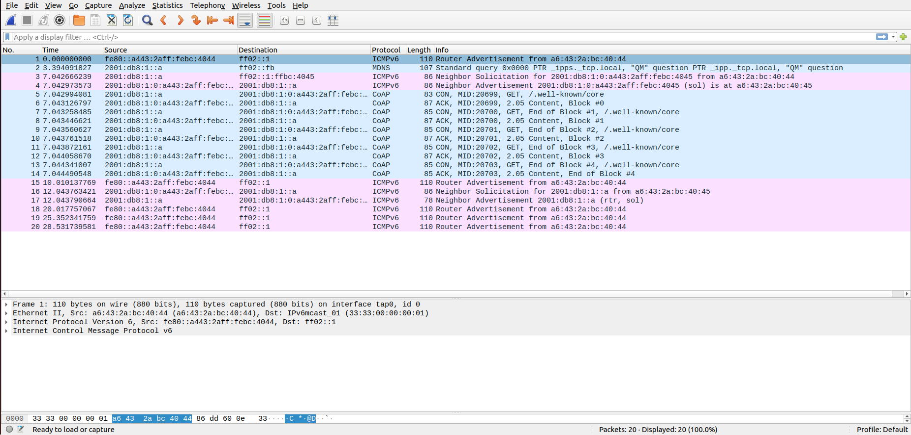
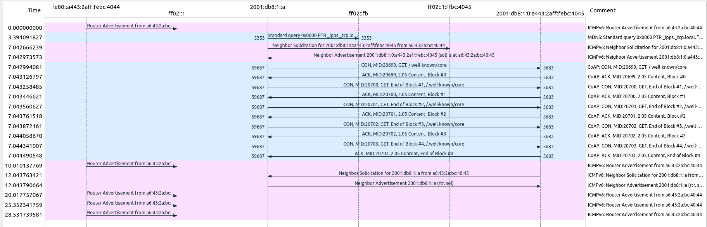
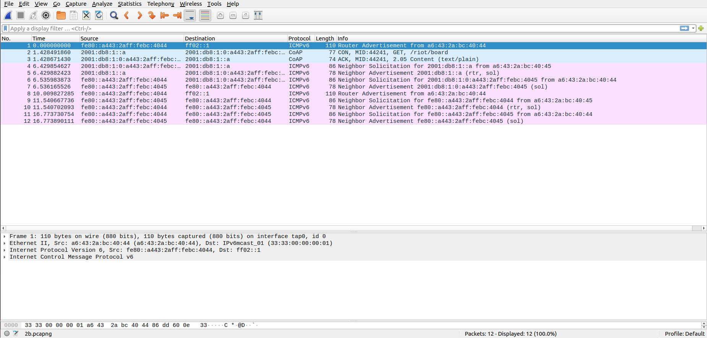
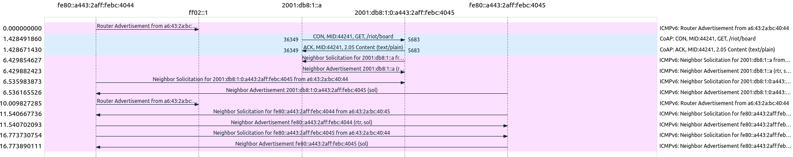
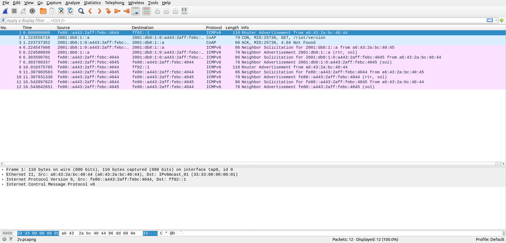
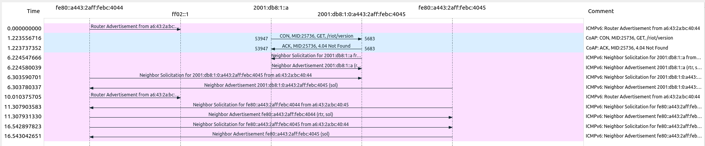
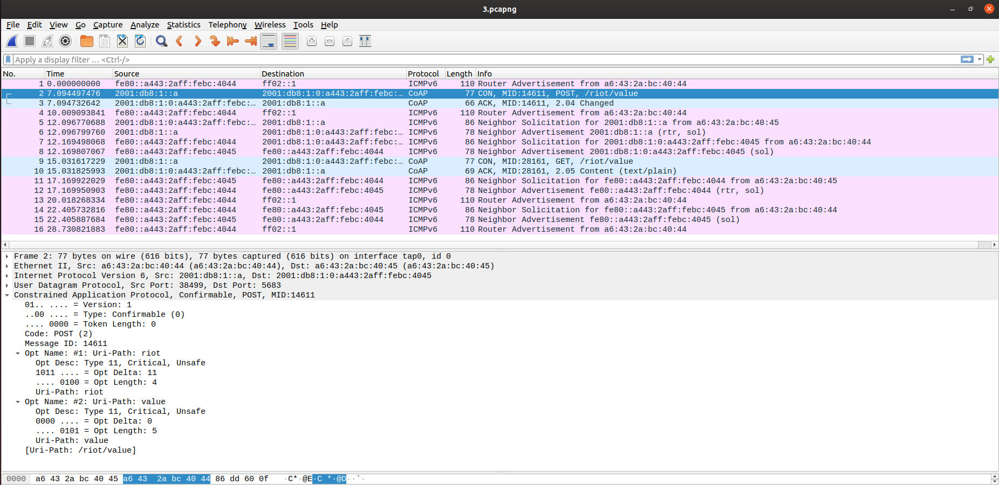
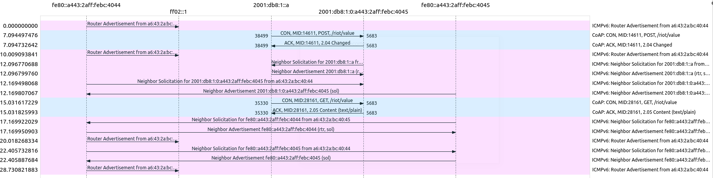
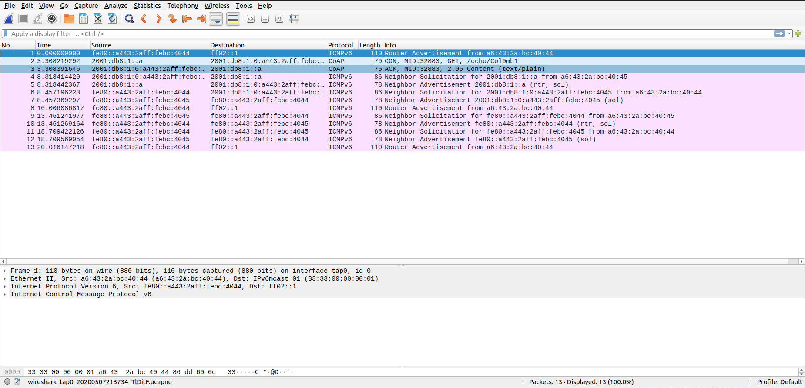
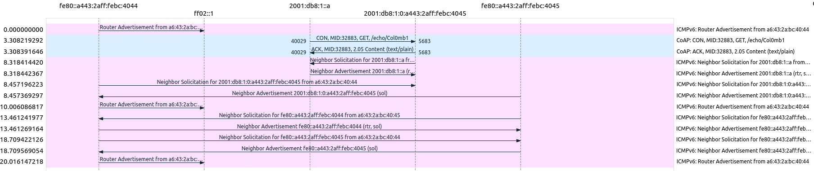

# EIOT Lab 3 - Coap

##### Arturo Cortés Sánchez

1. Discover all CoAP resources of the CoAP server by sending a GET request to the well-known URI (/.well-known/core). 

   a. Write in your report the list of all resources in the CoAP response. 

   ````
   </.well-known/core>,</echo/>,</riot/board>,</riot/value>,</riot/ver>,</sha256>
   ````

   b. Include in your report a screen shot of the traffic in Wireshark, and explain the message exchange between the CoAP server and the CoAP client for the GET request. 

   

   
   
   
   
   The client makes a GET request to the .known/core URI, but because the resource is too large, it is split into 5 blocks which are returned in 5 responses from the server.
   
   
   
   c. How many messages where sent from the CoAP client and how many in response from the CoAP server?  
   
   Both the client and the server send 5 messages each
   
   
   
2. Read out the values of the resources /riot/board and /riot/version. You will need to issue one GET request for each one of them.  

   a. Include the outputs in the report and the screenshot of the message exchange from Wireshark 

   ````
   coap-client -m get coap://[2001:db8:1:0:a443:2aff:febc:4045]/riot/board
   native
   ````

   

   

   

   

   ````
   coap-client -m get coap://[2001:db8:1:0:a443:2aff:febc:4045]/riot/version
   4.04
   ````

   

   

   

   b. How many messages where sent from the CoAP client and how many in response from the CoAP server? If this number is different from the one given in the first point, explain why it is the case. 

   

   In this case, each get request made with coap-client produces a message from the client and one from the server. Only one message is sent since the resource is small enough not to have to be divided into blocks.

   

3. Modify the value of the resource /riot/value using a CoAP request with the POST method, and then read it back by sending a CoAP request to the same URI using a GET method. The new value should be typed after the URI parameter of the coap-client command.  

   a. Include the outputs in the report and the screenshot of the message exchange from Wireshark 

   ````
   coap-client -m post coap://[2001:db8:1:0:a443:2aff:febc:4045]/riot/value hello
   ````

   ````
   coap-client -m get coap://[2001:db8:1:0:a443:2aff:febc:4045]/riot/value
   0
   ````

   

   

   

   b. Did you obtain the same value on the response to the GET request as it was issued in the POST request? If not, could you explain why? 

   

   The value of /riot/value has not changed because in the post request there was no payload field containing the new value

   

4. Test the URI /echo/. Choose a word from your mind and append it to the URI /echo/. For instance, if the word picked is “Col0mb1a”, the URI will be /echo/Col0mb1a. Send a CoAP request to this URI using the GET method. 

   a. Include the outputs in the report and the screenshot of the message exchange from Wireshark 

   ````
   coap-client -m get coap://[2001:db8:1:0:a443:2aff:febc:4045]/echo/Col0mb1
   Col0mb1
   ````

   

   

   b. What was included in the GET response by the CoAP server? What does this URI do? 

   

   The server's response includes the URI after /echo/. Requests to this URI return the remaining part of the URI after /echo/.